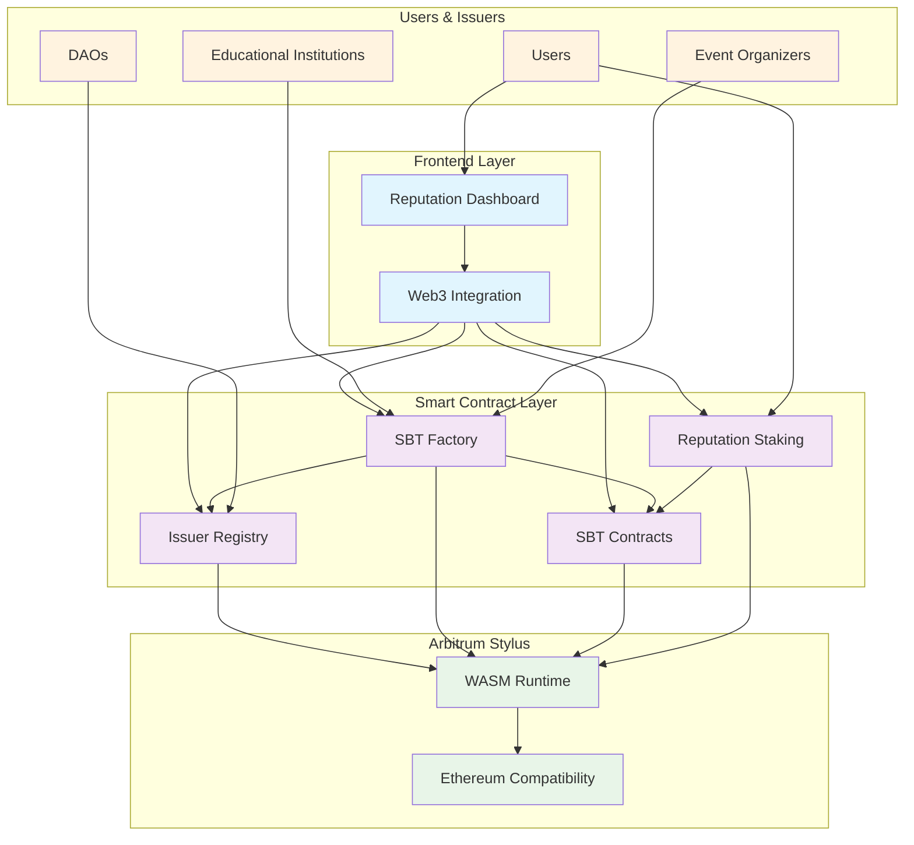
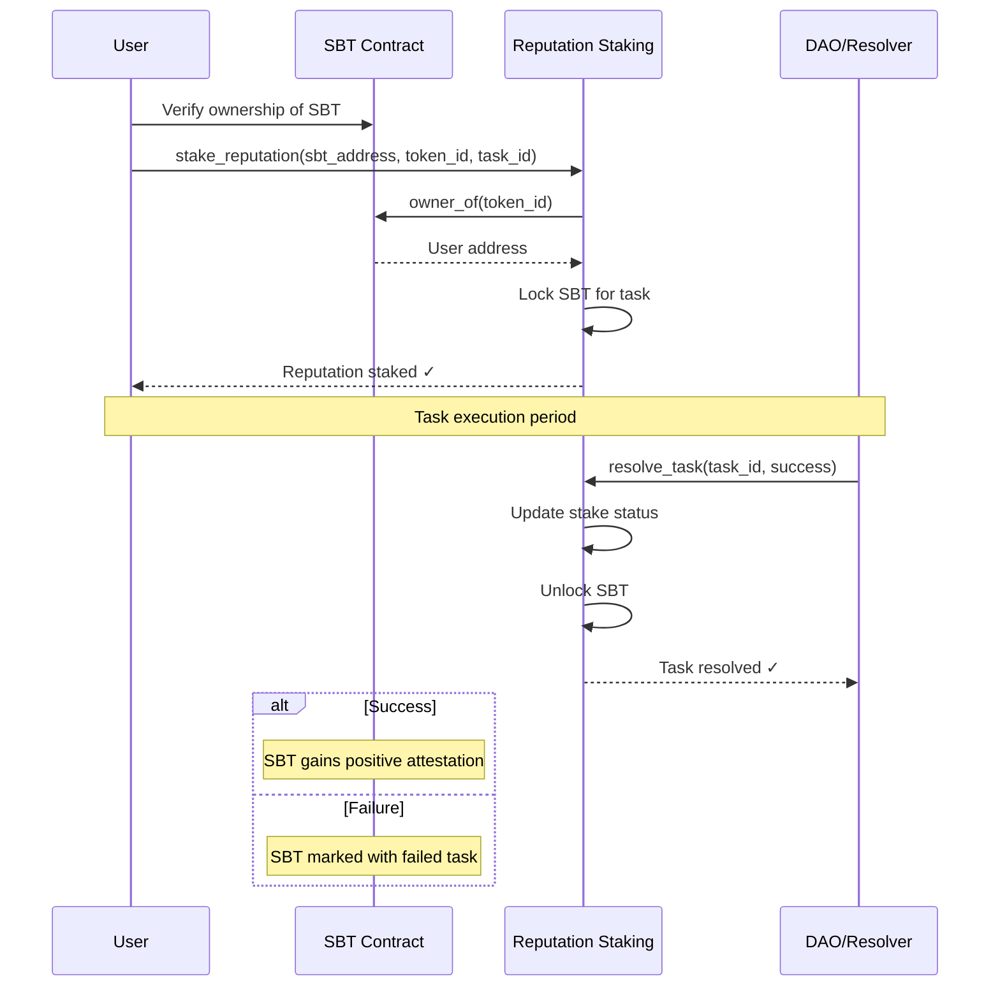

# Ethos - Decentralized Reputation System

[](https://arbitrum.io/stylus)
[](https://www.rust-lang.org)
[](https://opensource.org/licenses/MIT)

**Ethos** is a decentralized reputation system built on Arbitrum Stylus that enables users to build verifiable digital identities through Soulbound Tokens (SBTs). Unlike traditional systems where reputation can be bought, Ethos creates an identity that you *earn* through actions and achievements.

## 🏗️ Project Structure

```
ethos/
├── Cargo.toml                    # Workspace configuration
├── README.md                     # This file
├── LICENSE                       # MIT License
├── .gitignore                    # Git ignore rules
├── contracts/                    # Smart contracts (Stylus/Rust)
│   ├── issuer-registry/          # Manages trusted issuers
│   │   ├── Cargo.toml
│   │   └── src/
│   │       └── lib.rs
│   ├── sbt/                      # Soulbound Token implementation
│   │   ├── Cargo.toml
│   │   └── src/
│   │       └── lib.rs
│   ├── sbt-factory/              # SBT collection factory
│   │   ├── Cargo.toml
│   │   └── src/
│   │       └── lib.rs
│   └── reputation-staking/       # Reputation staking mechanism
│       ├── Cargo.toml
│       └── src/
│           └── lib.rs
├── packages/                     # Shared libraries
│   └── interfaces/               # Contract interfaces/traits
│       ├── Cargo.toml
│       └── src/
│           └── lib.rs
├── frontend/                     # Web application
│   ├── package.json
│   ├── src/
│   │   ├── components/           # React components
│   │   ├── pages/                # Application pages
│   │   ├── hooks/                # Custom React hooks
│   │   ├── utils/                # Utility functions
│   │   └── types/                # TypeScript type definitions
│   └── public/
├── scripts/                      # Deployment and utility scripts
│   ├── deploy.js                 # Contract deployment script
│   └── setup.js                 # Development setup script
└── docs/                         # Documentation
    ├── ARCHITECTURE.md           # Detailed architecture docs
    ├── DEPLOYMENT.md             # Deployment guide
    └── CONTRIBUTING.md           # Contribution guidelines
```

## 🎯 Vision & Core Features

### Vision
Create a platform where DAOs, educational institutions, event organizers, and protocols can issue verifiable, non-transferable tokens that collectively form a rich, multi-faceted on-chain reputation system.

### Core Features

1. **🏛️ Issuer Registry**: Whitelist of legitimate organizations that can issue SBTs
2. **🏭 SBT Factory**: Allows registered issuers to deploy new SBT collections
3. **🏅 Soulbound Tokens**: Non-transferable ERC-721 tokens representing achievements
4. **🎯 Reputation Staking**: Unique feature allowing users to stake reputation as social collateral
5. **📊 Reputation Dashboard**: Visual interface showing user's complete reputation profile

## 🏛️ System Architecture



## 💡 Reputation Staking Innovation

The **Reputation Staking** system is Ethos's unique value proposition:



## 🚀 Getting Started

### Prerequisites

- **Rust** 1.70+ ([Install Rust](https://rustup.rs/))
- **Node.js** 18+ ([Install Node.js](https://nodejs.org/))
- **Stylus CLI**: `cargo install --force cargo-stylus`
- **Git** for version control

### Development Setup

1. **Clone the repository**
   ```bash
   git clone https://github.com/your-org/ethos.git
   cd ethos
   ```

2. **Install Rust dependencies**
   ```bash
   cargo check
   ```

3. **Setup frontend**
   ```bash
   cd frontend
   npm install
   cd ..
   ```

4. **Build all contracts**
   ```bash
   # Check all contracts for compilation errors
   cargo stylus check -p issuer-registry
   cargo stylus check -p sbt
   cargo stylus check -p sbt-factory
   cargo stylus check -p reputation-staking
   ```

### Local Development

1. **Start frontend development server**
   ```bash
   cd frontend
   npm run dev
   ```

2. **Run contract tests**
   ```bash
   cargo test
   ```

3. **Deploy to testnet** (See [DEPLOYMENT.md](docs/DEPLOYMENT.md))
   ```bash
   cargo stylus deploy -p issuer-registry --private-key $PRIVATE_KEY --endpoint $ARBITRUM_SEPOLIA_RPC
   ```

## 🛠️ Development Workflow

### Branch Strategy
- `main`: Production-ready code
- `develop`: Integration branch for features
- `feature/*`: Individual features
- `hotfix/*`: Critical fixes

### Issue Labels
- `🏗️ contracts`: Smart contract development
- `🎨 frontend`: UI/UX development
- `📚 docs`: Documentation
- `🐛 bug`: Bug fixes
- `✨ feature`: New features
- `🔥 critical`: High priority issues

### Pull Request Process

1. **Create feature branch**
   ```bash
   git checkout -b feature/reputation-dashboard
   ```

2. **Make changes and commit**
   ```bash
   git add .
   git commit -m "feat: add reputation dashboard component"
   ```

3. **Push and create PR**
   ```bash
   git push origin feature/reputation-dashboard
   ```

4. **PR Requirements**
   - [ ] All tests pass
   - [ ] Code review by 2+ team members
   - [ ] Documentation updated
   - [ ] No merge conflicts


## 🧪 Testing Strategy

### Contract Testing
```bash
# Run all contract tests
cargo test

# Test specific contract
cargo test -p issuer-registry

# Test with coverage
cargo install cargo-tarpaulin
cargo tarpaulin --all
```

### Frontend Testing
```bash
cd frontend
npm run test          # Unit tests
npm run test:e2e      # End-to-end tests
npm run test:coverage # Coverage report
```

## 🔐 Security Considerations

- **Access Control**: Only registered issuers can create SBTs
- **Non-transferability**: Transfer functions explicitly disabled
- **Reputation Locking**: Prevents double-staking of SBTs
- **Task Resolution**: Only authorized resolvers can update stakes

## 📊 Gas Optimization

Stylus provides significant gas savings over traditional Solidity:
- **70-90% reduction** in execution costs
- **Efficient state management** with Rust's memory model
- **Lower deployment costs** with WASM compilation

## 🤝 Contributing

We welcome contributions! Please see [CONTRIBUTING.md](docs/CONTRIBUTING.md) for detailed guidelines.

### Quick Start for Contributors

1. **Pick an issue** from our [Issues tab](https://github.com/signor1/ethos/issues)
2. **Comment** on the issue to claim it
3. **Fork** the repository
4. **Create** feature branch
5. **Submit** pull request

## 📄 License

This project is licensed under the MIT License - see the [LICENSE](LICENSE) file for details.

## 🔗 Links

- **Documentation**: [docs/](docs/)
- **Arbitrum Stylus**: [stylus.arbitrum.io](https://stylus.arbitrum.io)
- **Issues**: [GitHub Issues](https://github.com/your-org/ethos/issues)
- **Discussions**: [GitHub Discussions](https://github.com/your-org/ethos/discussions)

---

**Built with ❤️ using Arbitrum Stylus**
